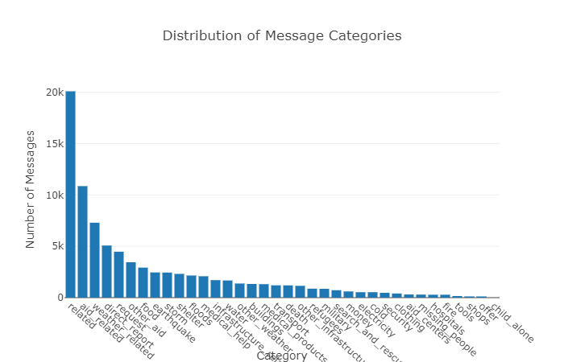

# Disaster Response Pipeline Project

# Table of contents
1. [Introduction](#introduction)
2. [Installation](#installation)
3. [Usage Instructions](#usage)
    1. [Extract, Transform, Load (ETL) Pipeline](#etl_pipeline)
    2. [Machine Learning (ML) Pipeline](#ml_pipeline)
    3. [Web App](#web_app)
4. [Jupyter Notebooks](#notebooks)
5. [Web App Usage](#web_app_usage)
6. [Data Visualization](#visualization)


## Introduction <a name="introduction"></a>

This project is part of [Udacity](https://www.udacity.com/)'s [Date Science Nanodegree](https://www.udacity.com/course/data-scientist-nanodegree--nd025) program. The dataset was provided by [Figure Eight](https://appen.com/).

The dataset contains labelled messages from disaster events. The goal of the project is to build a [Natural Language Processing](https://en.wikipedia.org/wiki/Natural_language_processing) (NLP) model and train the model to provide real-time categorization of messages in a web interface.


## Installation <a name="installation"></a>

This project contains a `requirements.txt` file that allows easy installation of the required libraries and utilities using the [anaconda](https://www.anaconda.com/products/distribution) python environment manager.

1. Download the project as a zip file or clone it using git.
2. In the project directory run the following conda  command:

```conda create --name <environment_name> --file requirements.txt```

## Usage Instructions <a name="usage"></a>

### Extract, Transform, Load (ETL) Pipeline <a name="etl_pipeline"></a>

Use this command to run the ETL pipeline that cleans the data and stores in database:

```python data/process_data.py data/disaster_messages.csv data/disaster_categories.csv data/disaster_messages.db```

### Machine Learning (ML) Pipeline <a name="ml_pipeline"></a>

Use this command to run the ML pipeline that builds a model, trains and saves it:

```python models/train_classifier.py data/disaster_messages.db models/classifier.pkl```

### Web App <a name="web_app"></a>

Run the following command in the `app` directory to run the web app.

```python run.py```

The web app can be accessed thought this link on the local host: http://0.0.0.0:3001/


1. Run the following commands in the project's root directory to set up your database and model.

    - To run ETL pipeline that cleans data and stores in database
        `python data/process_data.py data/disaster_messages.csv data/disaster_categories.csv data/DisasterResponse.db`
    - To run ML pipeline that trains classifier and saves
        `python models/train_classifier.py data/DisasterResponse.db models/classifier.pkl`

2. Run the following command in the app's directory to run your web app.
    `python run.py`

3. Go to http://0.0.0.0:3001/


## Jupyter Notebooks <a name="notebooks"></a>

The `jupyter` folder contains [jupyter](https://jupyter.org/) notebooks that walk through the ETL and ML pipelines with comments and visualizations.


## Web App Usage <a name="web_app_usage"></a>


A message can be entered into the web app. When submitted, the app uses the pre-trained ML model to classify the message, so the message can be routed to the appropriate agency.


## Data Visualization <a name="visualization"></a>


The messages are split into three genres: direct, news and social.



The messages are labelled. The distribution of messages along categories is not equal. In machine learning, this is called an imbalanced dataset. Unfortunately such bias in the dataset will result in the fitted machine learning model to also be biased. The quality of classification could be greatly improved by collecting more data and balancing the data set.


The above plot shows the distribution of messages based on word count, up to 80 words. there are only a few messages over 80 words, but some are as long as 1600 words. The classification could also be improved by concentrating on the most common message lengths and ignoring the outliars.


